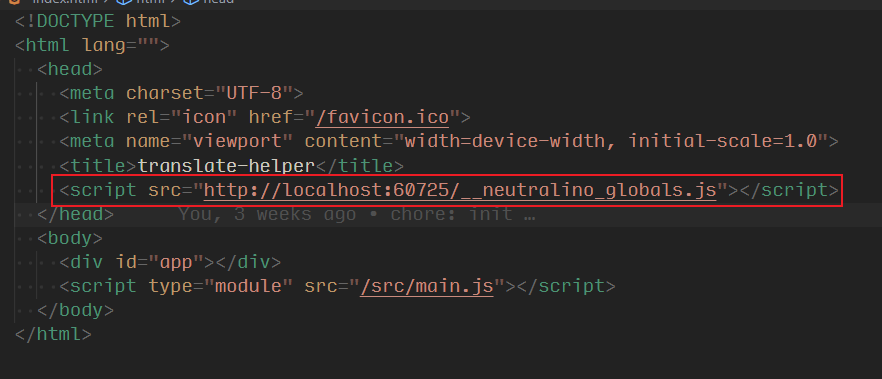
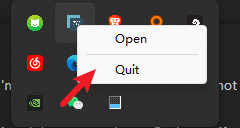

<br>
<br>
<p align="center">

</p>

<h1 align="center">TranslateHelper</sup></h1>

<p align="center">
A desktop translation assistance tool that supports translating multiple languages ​​at once.
</p>

English | [简体中文](./README.zh-CN.md)


## Introcution

A desktop translation assistance tool, currently only supports Windows platform, implemented using [Neutralinojs](https://neutralino.js.org/). Developed with reference to [raycast-multi-translate](https://github.com/antfu/raycast-multi-translate).

Why rewrite one?？

- Because [raycast-multi-translate](https://github.com/antfu/raycast-multi-translate) does not support the Windows platform, I use the Windows platform, so I re-implement one.

## TODO LIST

- [ ] Packaged into a single exe file
- [ ] Automatically start at boot

## Run

- Node > 16.0

```sh
npm install @neutralinojs/neu -g

neu update
# install extensions dependencies
cd ./extensions/node-extensions
npm install 

cd ../vue-src
pnpm install

cd ../..
neu run
```

- The inspection tool has been disabled and can be enabled through the following fields， Set the value of `enableInspector` to true。

```json
// neutralinojs.config.json
{
  ...
    "modes": {
    "window": {
     ...
     "enableInspector": false,
      ...
    }
  },
  ...
}
```

### Notes

#### Extensions

- Some features are not supported by `Neutralinojs`, but they can be written as extensions and implemented using `node`. Since the `neutralinojs` package will package `node`'s `node_modules` into the application, using `pnpm` requires reinstalling dependencies, so switch to npm to install node dependencies without reinstalling.

#### Injecting global variables

- When using `@neutralinojs/lib`, some global variables need to be injected. Without global variables, the websocket connection cannot be established, resulting in the inability to use the function. [Using Frontend Libraries](https://neutralino.js.org/docs/getting-started/using-frontend-libraries#initializiive-api-with-neutralinojslib)

- Add the following code to `index.html`：

```html
<script src="%PUBLIC_URL%/__neutralino_globals.js"></script>
```

- When running `neu run`, `%PUBLIC_URL%/` will be replaced by the new address, and the value will only be replaced back after exiting through the panel. [https://github.com/neutralinojs/neutralinojs/issues/1285](https://github.com/neutralinojs/neutralinojs/issues/1285)
  


- Since I set the close button to be hidden, it can only be restored after exiting from the system tray.



- Sometimes when a bug occurs and cannot be closed, `Ctrl+C` is used to force the process to close, resulting in the added code above not being restored. After packaging is completed, the code will not be usable. You can manually replace the content back.

## build

```sh
neu build
```

## Features

### Multiple Translations Targets

Supports translating multiple languages ​​at once. By clicking the settings button, you can add multiple translation targets.


### i18n

Support Chinese or English.


### Global shortcut key monitoring operation

- You can quickly hide and open applications through shortcut keys
- Note that using another shortcut key to open it will automatically read the clipboard content for translation. It can be used together with `Ctrl+C`.
  - This is also different from [raycast-multi-translate](https://github.com/antfu/raycast-multi-translate), which supports getting the selected text when the shortcut key is turned on. When there is selected text, the shortcut key can be opened to translate directly, but [Neutralinojs](https://neutralino.js.org/) does not support obtaining external selected text.

## License

It is [MIT](./LICENSE).
