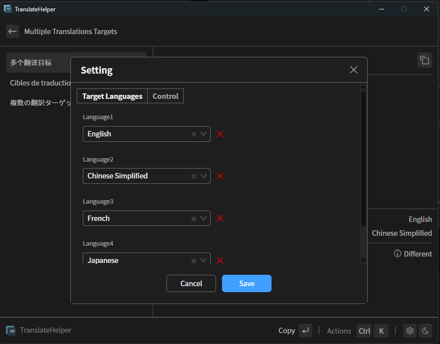

<br>
<br>
<p align="center">

</p>

<h1 align="center">TranslateHelper</sup></h1>

<p align="center">
A desktop translation assistance tool that supports translating multiple languages ​​at once.
</p>

English | [简体中文](./README.zh-CN.md)


## Introcution

A desktop translation assistance tool, currently only supports Windows platform, implemented using [Neutralinojs](https://neutralino.js.org/). Developed with reference to [raycast-multi-translate](https://github.com/antfu/raycast-multi-translate).

Why rewrite one?？

- Because [raycast-multi-translate](https://github.com/antfu/raycast-multi-translate) does not support the Windows platform, I use the Windows platform, so I re-implement one.

## Run

- Node > 18.0

Prerequisites, installation dependencies and compilation environment: [https://v2.tauri.app/start/prerequisites](https://v2.tauri.app/start/prerequisites)

```sh
pnpm install
pnpm run tauri-dev
```

## build

```sh
pnpm run tauri-build
```

## Features

### Multiple Translations Targets

Supports translating multiple languages ​​at once. By clicking the settings button, you can add multiple translation targets.



### i18n

Support Chinese or English.


### Global shortcut key monitoring operation

- You can quickly hide and open applications through shortcut keys
- Note that using another shortcut key to open it will automatically read the clipboard content for translation. It can be used together with `Ctrl+C`.
  - This is also different from [raycast-multi-translate](https://github.com/antfu/raycast-multi-translate), which supports getting the selected text when the shortcut key is turned on. When there is selected text, the shortcut key can be opened to translate directly, but [Neutralinojs](https://neutralino.js.org/) does not support obtaining external selected text.

## License

It is [MIT](./LICENSE).
