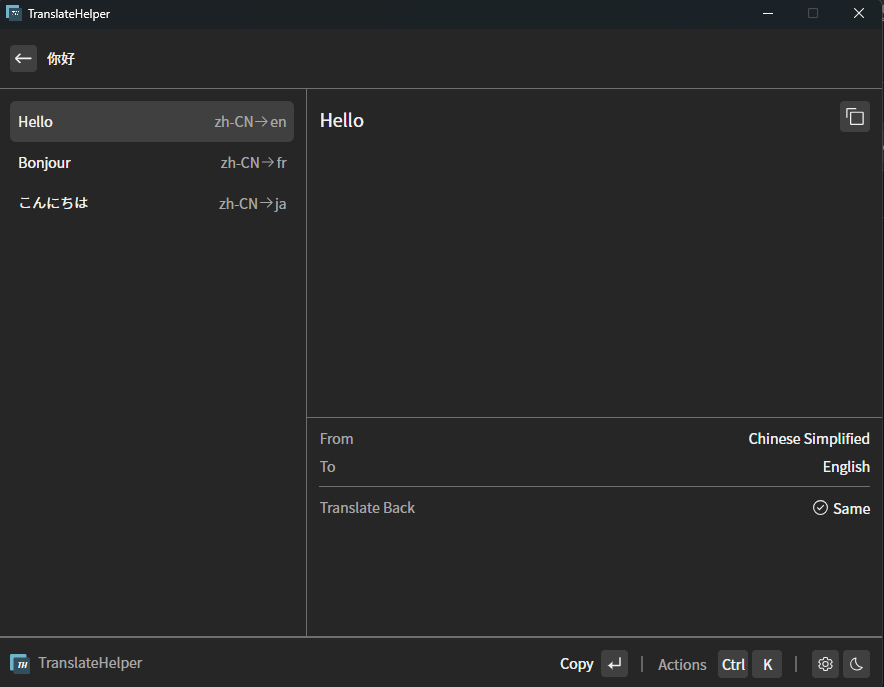
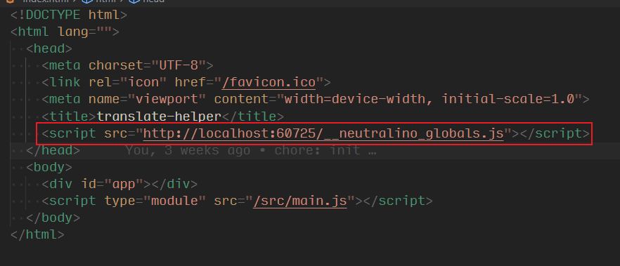
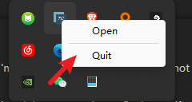
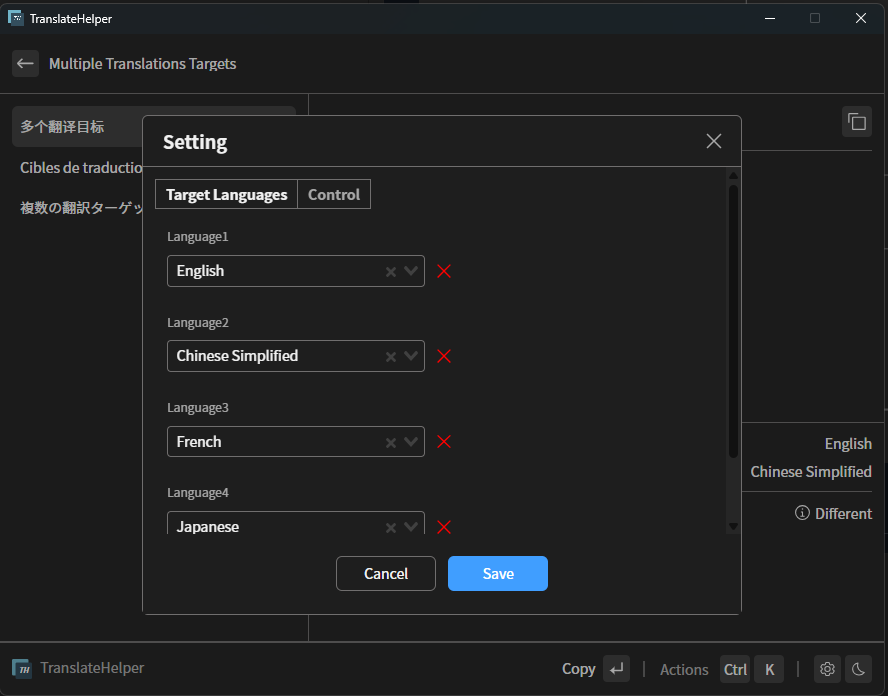
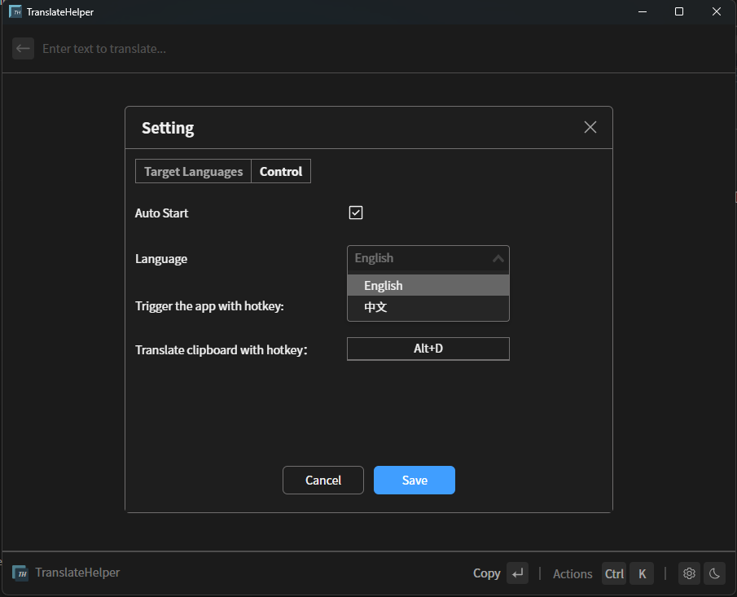
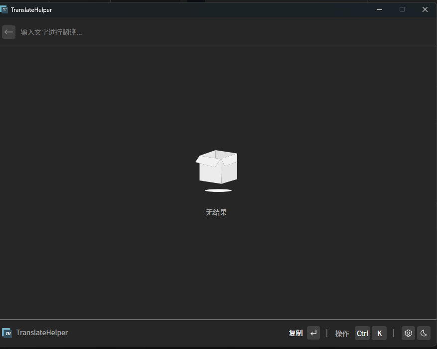

<br>
<br>
<p align="center">

</p>

<h1 align="center">TranslateHelper</sup></h1>

<p align="center">
一个桌面翻译辅助工具，支持一次翻译多个语言。
</p>

简体中文 | [English](./README.md)



## 介绍

一个桌面翻译辅助工具，当前仅支持Windows平台，使用[Neutralinojs](https://neutralino.js.org/)实现。参考[raycast-multi-translate](https://github.com/antfu/raycast-multi-translate)进行开发。

为什么重新写一个？

- 是因为[raycast-multi-translate](https://github.com/antfu/raycast-multi-translate)不支持windows平台，我使用的是windows平台，所以重新实现一个。

## TODO LIST

- [ ] 打包成一个单独的exe文件
- [ ] 开机自动启动

## 运行

- 使用node 16.0及以上的版本

```sh
npm install @neutralinojs/neu -g

neu update
# 安装extensions依赖
cd ./extensions/node-extensions
npm install 

cd ../vue-src
pnpm install

cd ../..
neu run
```

- 已经禁用开启检查工具，可以通过以下字段开启， 将`enableInspector`的值设置为true。

```json
// neutralinojs.config.json
{
  ...
    "modes": {
    "window": {
     ...
     "enableInspector": false,
      ...
    }
  },
  ...
}
```

### 注意

#### 扩展

- 一些功能`Neutralinojs`不支持，但是支持编写扩展，而且可以使用`node`实现。由于`neutralinojs`打包会将`node`的`node_modules`打包到进应用中，使用`pnpm`需要重新安装依赖，所以切换为npm安装node的依赖，不需要重新安装。

#### 注入全局变量

- 在使用`@neutralinojs/lib`需要注入一些全局变量，没有全局变量无法建立websocket连接，导致功能不能使用。[Using Frontend Libraries](https://neutralino.js.org/docs/getting-started/using-frontend-libraries#initializiive-api-with-neutralinojslib)

- 在`index.html`添加如下代码：

```html
<script src="%PUBLIC_URL%/__neutralino_globals.js"></script>
```

- 在运行`neu run`时，`%PUBLIC_URL%/`会被替换新地址，只有在通过通过面板上退出后，才会将值替换回来。 [https://github.com/neutralinojs/neutralinojs/issues/1285](https://github.com/neutralinojs/neutralinojs/issues/1285)
  


- 由于我设置了点击关闭按钮隐藏，只能从系统托盘退出后，才能还原。



- 当有些时候出现Bug无法关闭需要，`Ctrl+C`强制关闭进程，从而导致上面的添加的代码没有还原，在打包完成后会出现不能使用的问题，可以手动将内容替换回来。

## build

```sh
neu build
```

## 特性

### 多个翻译目标

支持一次翻译多个语言。通过点击设置按钮，可以添加多个翻译目标。



### i18n

支持中文和英文。




### 全局快捷键监听操作

- 可以通过快捷键快速隐藏和打开应用
- 使用另一个快捷键打开后会自动读取剪切板内容进行翻译，可以搭配`Ctrl+C`一起使用。
  - 这也是和[raycast-multi-translate](https://github.com/antfu/raycast-multi-translate)的区别，它支持快捷键打开时，获取选中文本。当有选中的文本时快捷键打开后直接进行翻译。但是[Neutralinojs](https://neutralino.js.org/)不支持获取外部的选中文本。

## FAQ

### 无法翻译

使用的是[@iamtraction/google-translate](https://github.com/iamtraction/google-translate)，谷歌翻译的接口，google翻译的接口被墙了无法使用。但是开启开启了代理后也可能无法使用，这是由于node在`windows`不会使用系统代理。
有以下方式解决这个问题：

- 需要使用`Tun`模式，`Tun`模式会拦截所有流量，能够真正实现全局代理。

## License

It is [MIT](./LICENSE).
